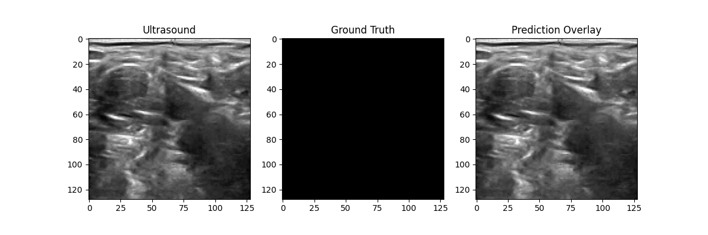

# Nerve Segmentation using Deep Learning
## Overview
This project performs automatic nerve segmentation from ultrasound images using multiple deep learning architectures. It compares the performance of different semantic segmentation models including U-Net, U-Net++, Attention U-Net, and Scale Attention U-Net.
The project aims to improve medical image segmentation accuracy while providing an easy-to-use implementation for experimentation and research.
## Features
- Medical ultrasound image segmentation
- Multiple deep learning architectures
- Model comparison
- Training and evaluation scripts
- Segmentation visualization
- Accuracy analysis
## Project Structure
ML-Ultrasound/
│
├── app.py
├── main.py
├── accuracy.py
├── test.py
├── cnn.py
├── u-net.py
├── unet++.py
├── attention-unet.py
├── scale-attention-unet.py
├── requirements.txt
├── Figure_1.png
└── README.md
## Models Implemented
- U-Net
- U-Net++
- Attention U-Net
- Scale Attention U-Net
- CNN BaselineThe dataset is not included in this repository because of its large size.

## Dataset
Download the Kaggle Ultrasound Nerve Segmentation dataset and place it inside:
[dataset/](https://www.kaggle.com/code/qmarva/ultrasound-nerve-segmentation)
## Installation
git clone https://github.com/nandineegohil24-glitch/Nerve-Segmentation-using-ML.git
cd Nerve-Segmentation-using-ML
pip install -r requirements.txt
## Usage
python main.py
## Results
python app.py

The following figure shows sample segmentation results.

## Technologies Used
- Python
- TensorFlow
- PyTorch
- OpenCV
- NumPy
- Pandas
- Matplotlib
## Future Improvements
- Improve segmentation accuracy
- Train on larger datasets
- Add transformer-based segmentation models
- Deploy as a web application
- Optimize inference speed
## Author
Developed by Nandinee Gohil.
